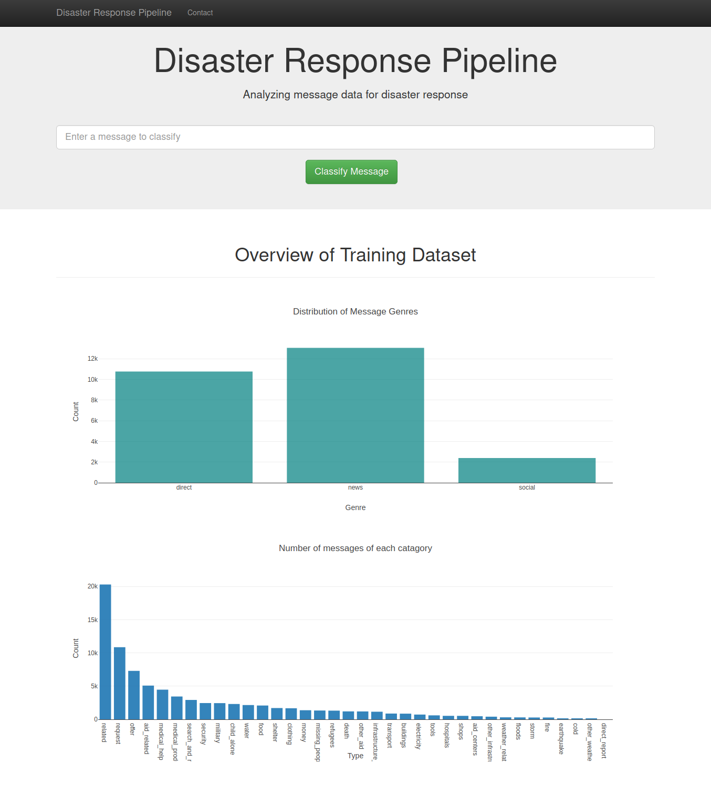
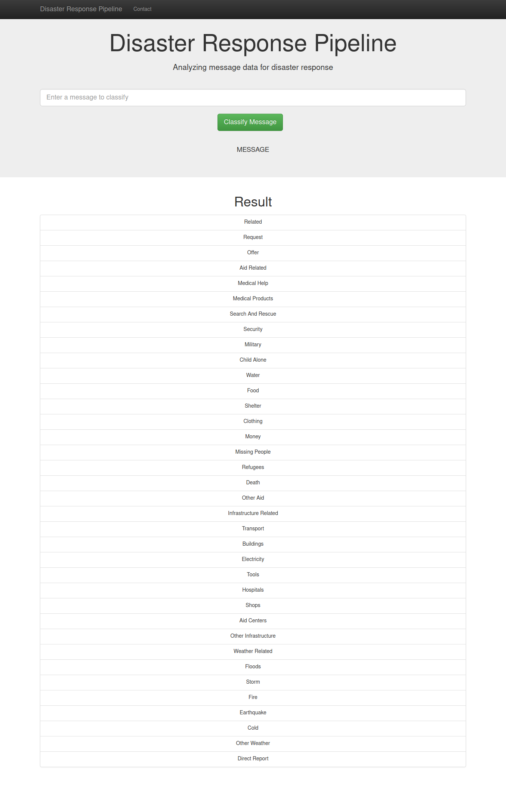

# Disaster Response Pipeline Project

The project uses disaster response data set cleans it using an ELT pipeline to provides visuals to better understand the data, it also uses Machine Learning pipeline to create a model which is used to predict the category of the new message 





## Motivation 

At times of disaster the management need to sort messages into different categories as to give the information to the organizations dealing with that categories of aid

## Dependency
1. flask
1. pandas
1. sklearn
1. sqlalchemy
1. nltk
1. plotly

## Run Instructions:
1. Install dependencies

    
    `pip install -r requirements.txt`

2. Run the following commands in the project's root directory to set up your database and model.
    

    - To run ETL pipeline that cleans data and stores in database
        

        `python data/process_data.py data/disaster_messages.csv data/disaster_categories.csv data/DisasterResponse.db`
        
    - To run ML pipeline that trains classifier and saves
        
        
        `python models/train_classifier.py data/DisasterResponse.db models/classifier.pkl`
        

3. Run the following command in the project's root directory to run your web app.


    `python app/run.py`

4. Go to http://0.0.0.0:3001/

## Data Set

The data set provided with provided by "figure eight", and contains messages sent during the disaster and its categories

## Description

This project contains three main parts

1. **ETL pipeline**
   * This is implemented in data/process_data.py
   * ELT pipeline takes data from two csv files (disaster_categories.csv & disaster_messages.csv) the cleans the data and loads data into an sqlite data base (DisasterResponse.db)
     
2. **NLP and Machine Learning pipeline**
   * This is implemented in models/train_classifier.py
   * This ML pipeline takes data from the sqlite data base (data/DisasterResponse.db) and trains a ML model, and stores it using pickling in models/classifier.pkl
     
3. **Web App**
   * This is the web interphase with which the user interacts
   * It uses data from data/DisasterResponse.db for visuals
   * It also uses ML model from models/classifier.pkl to classify new messages

## File Structure

```
├── README.md - a markdown file about this repo
├── app - a directory containing web app
│   ├── run.py - the file which when run will start the webapp
│   ├── templates - a directory containingtemplates for the webapp 
|   │   ├── master.html - the html page that is used at the root of the webapp
|   │   ├── go.html - the hml page used for show classification of message provided
├── data - a directory containing the data set, and script to process the data set
|    ├── process_data.py - a script that processes the data to be used for ml
|    ├── disaster_categories.csv - a file containing the disaster categories data 
|    ├── disaster_messages.csv - a file containing the disaster messages data
|    ├── DisasterResponse.db - a sqllote file containing the processed data (it will be created after running process_data.py with parameters as mentioned in run instructions)
├── models - a directory containing model and scripts to create the model
|    ├── train_classifier.py - a script that is used to create a ml model (classifier.pkl)
|    ├── classifier.pkl - a pickled of model used for classifing, messages into (it will be created after running train_classifier.py with parameters as mentioned in run instructiosn) categories, by webapp
```

## License

This project uses the MIT License